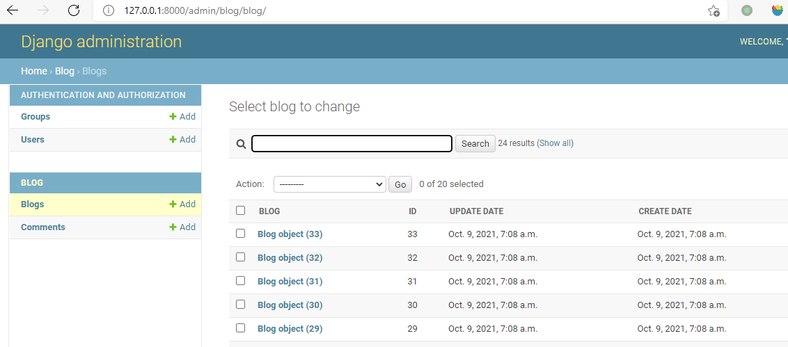
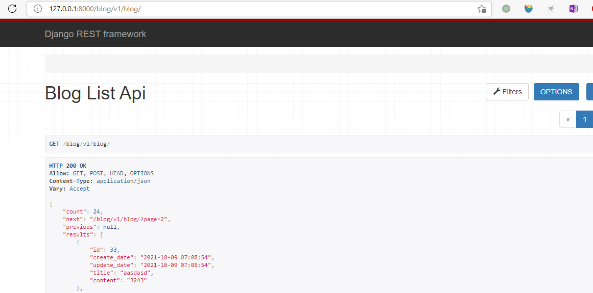

# Generic REST API Server

Generic RESTful API Server Use Django. Define models, and your APIs are already to use.


Features:

1. API
2. Admin
3. Reversion
4. Tags
5. Commit messages.

## Install

```
git clone https://github.com/sadnoodles/gras.git
pip install .
```

## Usage

1. Create an Django project.

`django-admin startproject test_project`

2. Create an app.

```
cd test_project
python manage.py startapp blog
```

3. Create Models

open `test_project\blog\models.py` add two models.

```python
from django.db import models
from gras.models import CommonAttr

# Create your models here.

class Blog(CommonAttr):
    title = models.CharField(max_length=200, blank=True)
    content = models.TextField()

class Comment(CommonAttr):
    blog = models.ForeignKey(Blog, on_delete=models.CASCADE)
    content = models.TextField()
```

4. Add admin

open `test_project\blog\admin.py` add two models.

```python
from django.contrib import admin
from gras.shortcut import init_admins
# Register your models here.

init_admins('blog')

```


5. Add API urls.


open `test_project\blog\urls.py` add urls.

```python
from django.conf.urls import url, include
from gras.shortcut import init_urls

urlpatterns = init_urls('blog')

```

And add theses urls to main url file.

open `test_project\test_project\urls.py` .

```python
urlpatterns = [
    ...
    url(r'^blog/', include(('blog.urls', 'blog'), namespace='blog')),
    ...
]

```

6. Add Settings.

File: `test_project\test_project\settings.py`

```python

INSTALLED_APPS = [
    ...
    'django_filters',
    'rest_framework',
    'gras',
    'blog',
    ...
]

...

DATETIME_FORMAT = '%Y-%m-%d %H:%M:%S'


REST_FRAMEWORK = {
    'DEFAULT_PERMISSION_CLASSES': [
        'rest_framework.permissions.IsAuthenticated',
    ],
    'DEFAULT_FILTER_BACKENDS': (
        'django_filters.rest_framework.DjangoFilterBackend',
        'rest_framework.filters.SearchFilter',
    ),
    'DEFAULT_AUTHENTICATION_CLASSES': (
        'rest_framework.authentication.SessionAuthentication',
        'rest_framework.authentication.BasicAuthentication',
    ),
    'DEFAULT_PAGINATION_CLASS': (
        'gras.pagination.PageNumberPagination'
    ),
    'PAGE_SIZE': 18,
    'SEARCH_PARAM':'s',
    'DATETIME_FORMAT': DATETIME_FORMAT,
    
}

```
7. Run.

Migrate db

`python manage.py makemigrations`

`python manage.py migrate`


Create super user

`python manage.py createsuperuser`

Run

`python manage.py runserver`


## Results

Admin page



REST API

  
